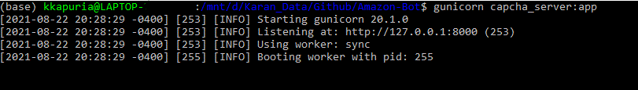
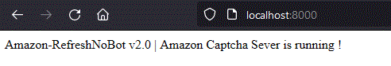
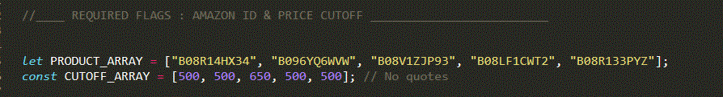
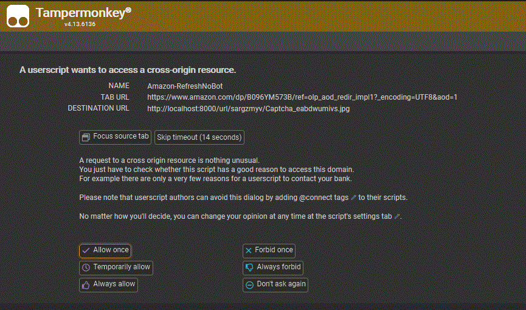

* Support & FAQ Discord : <a href="https://discord.gg/UcxcyxS5X8"></img></a>

```

Please star my repo if this contribution helped you ! Its FREEE !

Please Join Support & FAQ Discord if you have questions.

```
# FREE Amazon Buy Bot — Open Source GPU/PS5/Xbox Bot

## Description

FREE Amazon Buy Bot is an Add to Cart and Auto Checkout Bot. This auto buying bot can search **multiple** item repeatedly on the item page using `AMAZON_PRODUCT_ID`. Once the desired item is available it can add to cart and checkout very fast. This auto purchasing Bot works on browsers so it can run in all Operating Systems. It can run for multiple items simultaneously. It can bypass Amazon Captcha.

"Running a bot can increase your success chances only ; but does not guarantee that you will successfully cart each time. If you do not agree, then please do not use this code."

## Getting Started

1. Create a [github](https://github.com/login?return_to=%2Fkkapuria3) account. It always helps !
2. Star this repository. Its FREE !
3. Please follow me here if you like my contribution: [](https://github.com/kkapuria3)

### Dependencies

#### 1. Browser Dependencies

1. Install [Tampermonkey Extention](https://www.tampermonkey.net/)
2. Amazon Account 
3. Please allow [Pop-Ups](https://www.isc.upenn.edu/how-to/configuring-your-web-browser-allow-pop-windows) for ```https://www.amazon.com/``` in your browser

#### 2. Local Dependencies

1. Python 3.7+ in a Terminal. You can use either [WSL2](https://docs.microsoft.com/en-us/windows/wsl/about) or [CMD](https://www.google.com/search?client=firefox-b-1-d&q=windows+command+prompt) or [PowerShell](https://docs.microsoft.com/en-us/powershell/) or [Ananconda Prompt](https://docs.anaconda.com/anaconda/user-guide/getting-started/) to run python.

### Installing

#### 1. Browser Dependencies

* Go to tampermonkey dashboard from broswer extension and create a new script
* Delete all the contents and copy full code from [free-amazon-bot.js](https://raw.githubusercontent.com/kkapuria3/Amazon-Bot/main/free-amazon-bot.js)
* Save the script

#### 2. Local Dependencies
* Clone this repository to a folder you like with command `git clone https://github.com/kkapuria3/Best-Amazon-Bot.git`
* Navigate to location where you cloned this; using your favourite shell
* Run `pip install -r requirements.txt`

### Running Bot

1. From your terminal, inside the cloned location run `gunicorn capcha_server:app`. It will look like this.



2. Go to [`http://localhost:8000/`](http://localhost:8000/) on your browser. And your browser will look like:



3. Now go to our TamperMonkey script and Add the 10 digit Amazon item code in `AMAZON_PRODUCT_ID` array and respective cut-off price in `CUTOFF_ARRAY`



4. You are all set. Now navigate to your item page and you should see the bot work. 

5. When you get captcha for first time you will get this prompt. You can click `Always Allow` or `Allow Once (might have to press everytime)` 



### Where to go from here / still not working ?

* Join our discord community [here](https://discord.gg/UcxcyxS5X8)
* Ask in #general-help channel if you have problems setting up. 
* Drops alerts on our [discord](https://discord.gg/UcxcyxS5X8)are forwared from multiple third-party telegrams.

## Authors

* Karan Kapuria

<a href="https://www.buymeacoffee.com/kapuriakaran" target="_blank"></a>


## Version History and Changelog

* 1.0-beta - Runs only Testmode.
* - Code is not complete commented.
* - No support for Amazon Captcha (Soft Ban) - Future support with local flask server
* - Dog Pages are not handled
* 1.1-beta - Fixed Sellers Loop
* - When in Sellers, Used items are not checked for
* - Still No support for Amazon Captcha (Soft Ban) & Dog Pages
* - More code commented
* 2.0 - Fully Functional Bot with Local Gunicorn Server
* - Using flask, gunicorn and amazoncapcha; we solve Amazon Captcha (Soft Ban)
* - No autocheckout yet. *Will be released as minor update later.*
* - Faster page reload on seller pages (4 Seconds)
* - When cart is disabled with Dog Pages, it will refresh cart every 10 second
* - When resellers are disabled, bot will show 0 items and refresh
* - More code commented


## License

This project is licensed under the MIT License - see the LICENSE.md file for details
