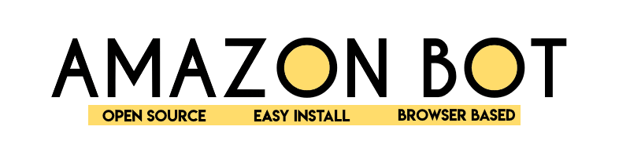

* Support & FAQ Discord : <a href="https://discord.gg/UcxcyxS5X8"></img></a>
* **Supports all the browsers. This bot is in beta version, please read Version History** 

```

Please star my repo if this contribution helped you ! Its FREEE !

Please Join Support & FAQ Discord if you have questions.

```
# BestBuy Bot — Open Source GPU/PS5/Xbox Bot

## Description

Amazon Bot is an Add to Cart and Auto Checkout Bot. This auto buying bot can search **multiple** item repeatedly on the item page using `AMAZON_PRODUCT_ID`. Once the desired item is available it can add to cart and checkout very fast. This auto purchasing Bot works on browsers so it can run in all Operating Systems. It can run for multiple items simultaneously.

"Running a bot can increase your success chances only ; but does not guarantee that you will successfully cart each time. If you do not agree, then please do not use this code."

## Why???

I built this in response to the severe tech scalping situation that's happening right now. Almost every tech product that's coming out right now is being instantly brought out by scalping groups and then resold at at insane prices. $699 GPUs are being listed for $1700 on eBay, and these scalpers are buying 40 carts while normal consumers can't get a single one. Preorders for the PS5 are being resold for nearly $1000. My take on this is that if I release a bot that anyone can use, for free, then the number of items that scalpers can buy goes down and normal consumers can buy items for MSRP. If everyone is botting, then no one is botting.


```
#fairgame
```

## Getting Started

1. Create a [github](https://github.com/login?return_to=%2Fkkapuria3) account. It always helps !
2. Star this repository. Its FREE !
3. Please follow me here if you like my contribution: [](https://github.com/kkapuria3)

### Dependencies

2. Install [Tampermonkey Extention](https://www.tampermonkey.net/)
3. Amazon Account 
4. Please allow [Pop-Ups](https://www.isc.upenn.edu/how-to/configuring-your-web-browser-allow-pop-windows) for ```https://www.amazon.com/``` in your browser


### Installing

* Successfully download and install both extensions in your browser
* Go to tampermonkey dashboard from broswer extension and create a new script
* Delete all the contents and copy full code from [free-amazon-bot.js](https://raw.githubusercontent.com/kkapuria3/BestBuy-GPU-Bot/main/best-buy-tm.js)
* Add the 10 digit Amazon item code in `AMAZON_PRODUCT_ID` array and respective cut-off price in `CUTOFF_ARRAY`
* Save the script


## Authors

* Karan Kapuria

<a href="https://www.buymeacoffee.com/kapuriakaran" target="_blank"></a>


## Version History and Changelog

* 1.0-beta - Runs only Testmode.
* - Code is not complete commented.
* - No support for Amazon Captcha (Soft Ban) - Future support with local flask server
* - Dog Pages are not handled


## License

This project is licensed under the MIT License - see the LICENSE.md file for details
